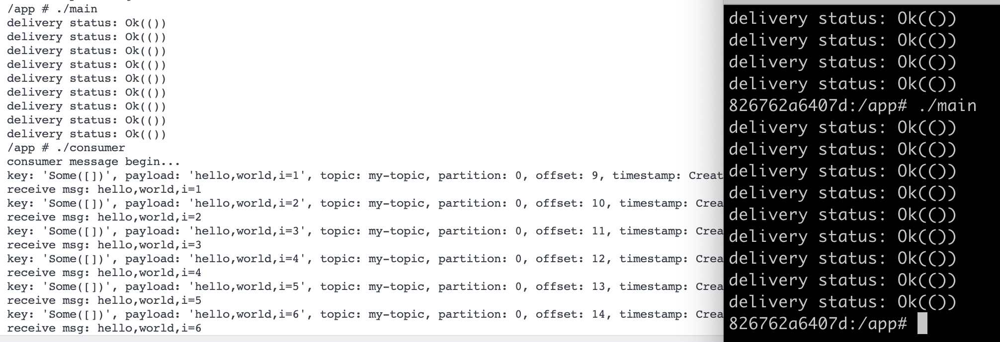

# rust rdkafka

rust使用rdkafka实现消息发送和消费

- rust rdkafka官网: https://crates.io/crates/rdkafka
- rdkafka crate: https://github.com/fede1024/rust-rdkafka 更多用法看官方examples
- librdkafka官网：https://github.com/confluentinc/librdkafka the Apache Kafka C/C++ library
- rust kafka实现消息发送和消费，这里使用的是rdkafka，相比rskafka和kafka crate，稳定性和兼容性更好。
- rdkafka这个库是基于c语言编写的，性能高。
- 如果不需要kafka更多配置，可以直接使用kafka = "0.10.0" 这个crate: https://crates.io/crates/kafka

基于rdkafka封装的broker见: https://github.com/rs-god/rs-broker

# kafka in docker

启动kafka容器

```shell
docker-compose up -d
```

如果配置文件有变更或容器已存在，需要强制重新创建并启动：

```shell
# 强制重新创建容器并启动
docker-compose up -d --force-recreate

# 强制重新构建镜像并启动
docker-compose up -d --build

# 强制重新创建并忽略孤儿容器
docker-compose up -d --force-recreate --remove-orphans
```

或者使用kafka-native镜像：

```shell
make kafka
```

进入容器后，创建topic

```shell
cd /opt/kafka
bin/kafka-topics.sh --create --topic my-topic --bootstrap-server localhost:9092
```

# install librdkafka

- macos安装方式：

```shell
brew install pkgconf
brew install zlib
brew install librdkafka
```

- apt安装方式：

1. 安装相关依赖

```shell
apt-get install -y build-essential libcurl4-openssl-dev libssl-dev zlib1g-dev pkg-config wget curl
```

2. 源码cmake编译安装

```shell
cd /opt && wget https://github.com/confluentinc/librdkafka/archive/refs/tags/v2.12.1.tar.gz
tar -zxf v2.12.1.tar.gz && cd /opt/librdkafka-2.12.1 && mkdir build && cd build && cmake ..
make && make install
```

3. 设置环境变量

```shell
export PKG_CONFIG_PATH=/usr/local/lib/pkgconfig
export PKG_CONFIG_ALLOW_SYSTEM_LIBS=1
export PKG_CONFIG_ALLOW_SYSTEM_CFLAGS=1
```

建议将上面的环境变量设置放入`~/.bash_profile`文件，然后执行`source ~/.bash_profile`生效。

4. 查看是否安装成功

```shell
pkg-config --modversion rdkafka
```

# rdkafka in docker

本项目提供两种容器化环境：**Alpine**（默认，根目录）和 **Debian**（位于 `debian/` 目录）。

## 镜像说明

| 环境     | 开发镜像 Dockerfile                                | 运行镜像 Dockerfile                        | 说明                                                                                                         |
|--------|------------------------------------------------|----------------------------------------|------------------------------------------------------------------------------------------------------------|
| Alpine | [rust-dev.Dockerfile](rust-dev.Dockerfile)     | [Dockerfile](Dockerfile)               | 默认环境，基于 `rust:1.97.1-alpine` 构建开发镜像 `alpine-rs-dev:v1.0`，运行镜像基于 `alpine-rs-dev:v1.0` 和 `alpine:3.24` 两阶段构建 |
| Debian | [debian/Dockerfile-dev](debian/Dockerfile-dev) | [debian/Dockerfile](debian/Dockerfile) | 基于 `rust:1.97.1-bullseye` / `debian:bullseye-slim`                                                         |

> 注意：运行镜像的构建基于对应的基础开发镜像（`rs-dev:v1.0` 或 `alpine-rs-dev:v1.0`），请先构建开发镜像。

## 构建特性

### 静态链接

Alpine 环境使用 `-crt-static` + `PKG_CONFIG_ALL_STATIC=1` 的组合：

```dockerfile
ENV RUSTFLAGS="-C target-feature=-crt-static"
ENV PKG_CONFIG_ALL_STATIC=1
```

原因：

- Alpine 的 Rust host target 是 `x86_64-unknown-linux-musl`，且该 target **默认启用 `+crt-static`**
- 默认的 `+crt-static` 会导致 `async-trait` 等 proc-macro crate 无法编译（proc-macro 必须是动态库）
- 使用 `-crt-static` 可以关闭默认的静态 C 运行时链接，让 proc-macro 正常编译
- `PKG_CONFIG_ALL_STATIC=1` 仍然会让 `rdkafka-sys` 尽量静态链接 openssl、sasl、zstd、lz4、curl 等依赖到最终二进制

> 注意：基础镜像 [rust-dev.Dockerfile](rust-dev.Dockerfile) 中保留 `RUSTFLAGS="-C target-feature=+crt-static"`
> 作为开发环境配置；根目录 [Dockerfile](Dockerfile) 会根据实际编译需要覆盖为 `-crt-static`。

### 国内镜像加速

Alpine 构建中通过 `sed` 将 apk 默认源替换为清华镜像源，以加速依赖下载：

```dockerfile
sed -i 's|dl-cdn.alpinelinux.org|mirror.tuna.tsinghua.edu.cn|g' /etc/apk/repositories
```

### 时区配置

Alpine 环境设置时区为 `Asia/Shanghai`：

```dockerfile
ENV TZ=Asia/Shanghai
```

### rdkafka 版本一致性

为避免基础镜像与运行镜像中 rdkafka 版本不一致，运行镜像直接复用基础镜像 `alpine-rs-dev:v1.0` 中已编译好的 rdkafka 动态库：

```dockerfile
COPY --from=builder /usr/local/lib/librdkafka.so* /usr/local/lib/
COPY --from=builder /usr/local/lib/pkgconfig/rdkafka*.pc /usr/local/lib/pkgconfig/
```

由于 builder 阶段基于 `alpine-rs-dev:v1.0`，而 `alpine-rs-dev:v1.0` 中的 rdkafka 版本是固定的，因此运行镜像中的 rdkafka 版本与基础镜像完全一致。

> 基础镜像 [rust-dev.Dockerfile](rust-dev.Dockerfile) 在安装 rdkafka 时也会生成 `/opt/rdkafka.version` 和 `/opt/rdkafka.tar.gz`，用于记录版本和保留源码包。

### 运行时镜像精简

根目录 [Dockerfile](Dockerfile) 的运行阶段不再重新编译 rdkafka，而是从 builder 阶段直接复制已编译好的动态库。运行时仅安装必要的运行时依赖库：

```dockerfile
RUN apk add --no-cache \
    bash \
    ca-certificates \
    tzdata \
    openssl \
    zlib \
    zstd-libs \
    lz4-libs \
    curl \
    cyrus-sasl
```

相比重新编译 rdkafka 的方案，这样显著减少了：
- 构建时间（无需执行 cmake/make）
- 镜像体积（无需安装构建工具链）
- 运行时依赖复杂度

同时通过 `LD_LIBRARY_PATH=/usr/local/lib` 确保 rdkafka 动态库可被正确加载。

### 关闭 rdkafka 非必要构建

rdkafka 的 `cmake` 命令关闭了 tests 和 examples，避免在 musl 环境下因缺失相关头文件导致构建失败：

```dockerfile
cmake -DRDKAFKA_BUILD_TESTS=OFF -DRDKAFKA_BUILD_EXAMPLES=OFF ..
```

## Alpine 环境（默认）

在仓库根目录下执行：

```shell
# 构建rust运行环境的基础镜像
make build-dev

# 构建应用运行镜像
make build

# 运行容器
make run

# 停止并重新运行容器
make rerun

# 重新构建镜像并运行容器
make rebuild

# 查看容器日志
make logs

# 进入容器
make exec
```

进入容器运行消息发送：

```shell
docker exec -it alpine-rs-broker-demo /bin/bash
# /app# ls
# bin  consumer  main
# /app# ./main
```

## Debian 环境

进入 `debian/` 目录后执行：

```shell
cd debian

# 构建rust运行环境的基础镜像
make build-dev

# 构建应用运行镜像
make build

# 运行容器
make run

# 停止并重新运行容器
make rerun

# 重新构建镜像并运行容器
make rebuild

# 查看容器日志
make logs

# 进入容器
make exec
```

进入容器运行消息发送：

```shell
docker exec -it rs-broker-demo /bin/bash
# root@xxx:/app# ls
# bin  consumer  main
# root@xxx:/app# ./main
```



运行效果如下：

